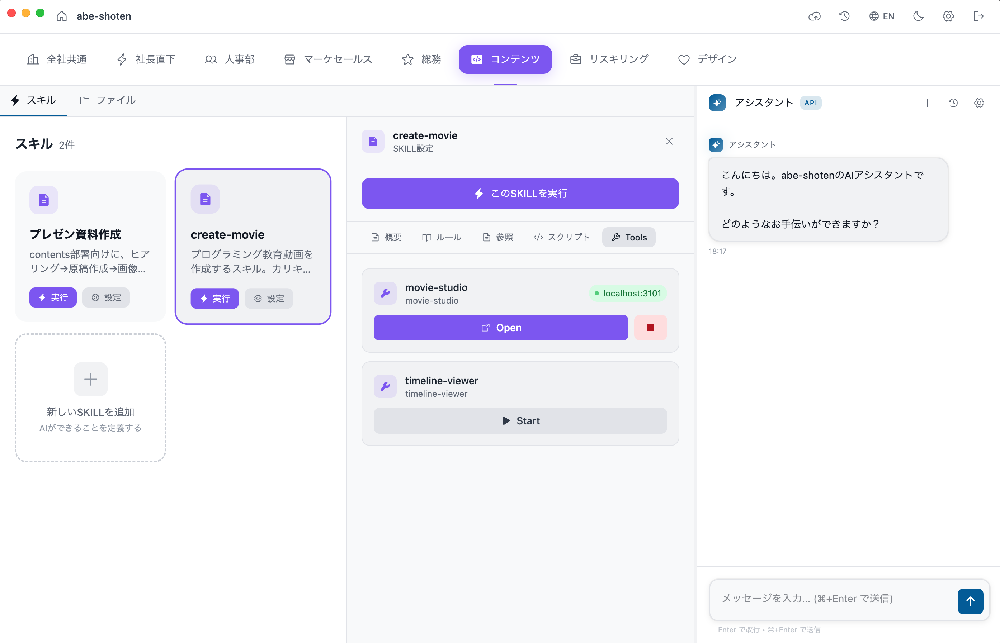
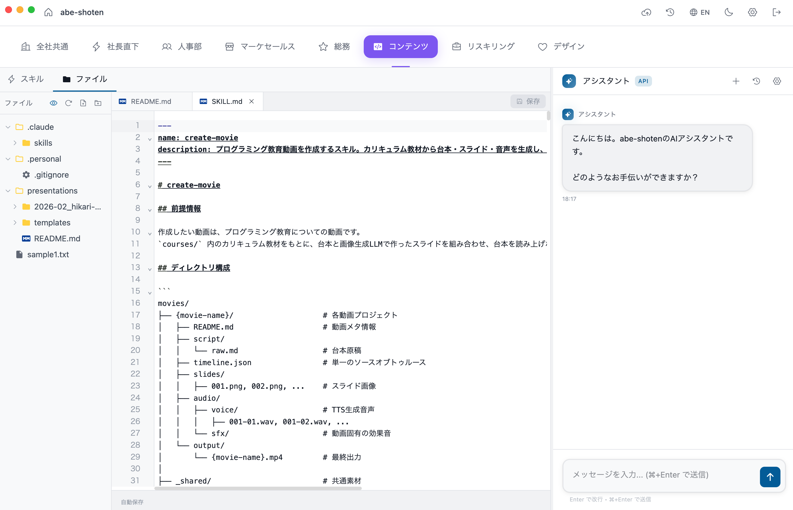
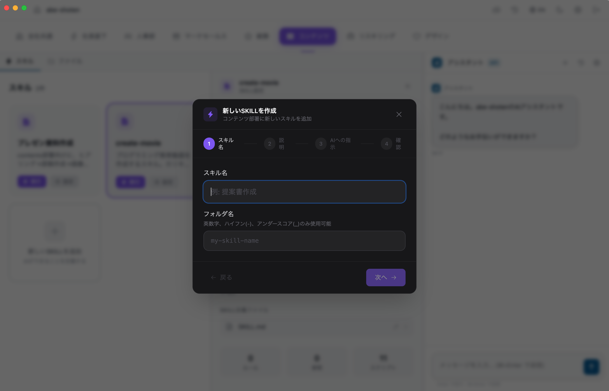
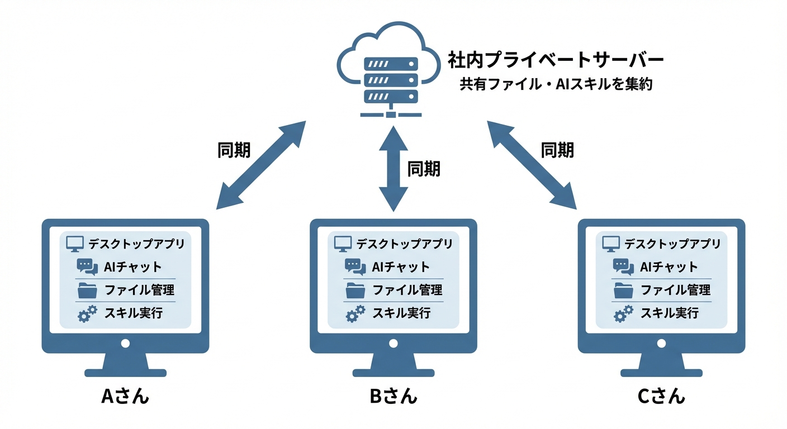

# AI Company Builder

**AI スキルをチームで共有 — フォルダに置くだけ。**
**AIが育つ組織を育てる。**

**「同期」を押すだけ。** Gitの知識もターミナルも不要。チームのAIスキル、ファイル、フォルダが一瞬で全員に共有されます。

> Notion + Dropbox + AIプロンプトの手動共有…の代替

[English](README.md)

## これは何？

デスクトップアプリ + セルフホストサーバーで構成される、チーム向け AI スキル共有プラットフォームです。AI エージェントのスキルファイル、ドキュメント、コンテキストを、フォルダに置くだけでチーム全員に共有できます。

Gitの知識は不要。「同期」ボタンを押すだけです。

**Convention over Configuration** — フォルダ構造がそのまま設定になります。

### スキル内のカスタムツールをワンクリックで起動



### 内蔵エディタで SKILL.md やファイルを編集



### GUI から新しいスキルを作成 — ターミナル不要



## 特徴

- **スキル共有** — 部署フォルダにスキルファイルを置くだけで、チーム全員に即座に共有
- **ワンボタン同期** — Gitは裏側で使用（ユーザーは Git を意識しない）
- **セルフホスト** — データは自社サーバーに。外部サービスへの依存なし
- **Git同梱** — Git 未インストール環境でも動作
- **部署管理** — チーム/部署ごとにスキルとファイルを整理
- **個人ワークスペース** — `.personal/` フォルダは同期されない個人用スペース
- **HTTPS Git 転送** — SSH 鍵の管理不要
- **シンプルなコンフリクト解決ルール** — サーバー版を優先、ローカルの変更は自動バックアップ

## アーキテクチャ

```
┌─────────────────┐         HTTPS          ┌─────────────────┐
│  デスクトップ     │◄──────────────────────►│  セルフホスト     │
│  アプリ          │    Git Smart HTTP      │  サーバー         │
│  (Electron)     │    + REST API           │  (Hono)         │
│                 │                        │                 │
│  - ファイル管理   │                        │  - Git bare repo│
│  - AI チャット    │                        │ - SQLite DB    │
│  - スキル実行     │                        │  - 認証          │
│  - 同期ボタン     │                        │                 │
└─────────────────┘                        └─────────────────┘
```



## クイックスタート

```bash
git clone https://github.com/eichann/ai-company-builder.git
cd ai-company-builder
```

### 1. まずローカルで動かす

コードに触れる前に、プロダクト全体——APIサーバー・管理画面・データ——が動くところを見たい場合はこちら。Docker さえあれば、ほかのセットアップは不要です。

```bash
cp .env.example .env
echo "AUTH_SECRET=$(openssl rand -base64 32)" >> .env
docker compose up -d
```

これで2つのコンテナが起動します：APIサーバー（http://localhost:3001）と管理画面（http://localhost:3100）。ブラウザで http://localhost:3100 を開き、サインアップ（最初のアカウントになります）→ 会社を作成すれば、サーバー側の動作一式をローカルで確認できます。

デスクトップクライアント（Electron）も試す場合は、サーバーを起動したまま、**リポジトリのルートで**以下を実行します（Node.js 20+ と pnpm 9+ が必要）：

```bash
pnpm install   # 初回のみ
pnpm dev       # クライアントが起動する
```

初回起動時にサーバーURLを聞かれるので `http://localhost:3001` を入力してください。

> **AI チャットには Claude Code が必要です。** クライアントは AI チャットを動かす際、お使いのマシン上で [Claude Code](https://docs.anthropic.com/ja/docs/claude-code) CLI を起動します。先にインストールしてログインしてください。クライアント本体は **Windows・macOS・Linux でネイティブに動作します**（クライアントに WSL2 は不要です）。
> - **Windows**: [Git for Windows](https://git-scm.com/download/win) をインストールし、PowerShell で `irm https://claude.ai/install.ps1 | iex` を実行
> - **macOS / Linux**: `curl -fsSL https://claude.ai/install.sh | bash` を実行
>
> その後 `claude` を一度起動してログインしてください（Claude Pro / Max プランでOK）。従量課金の API を使いたい場合は、アプリの設定で Anthropic API キーを設定してください。

### 2. 開発する

コードを変更したい場合はこちら。各プロセスを直接起動するため、編集内容がホットリロードで即座に反映されます。Node.js 20+ と pnpm 9+ が必要です。（デスクトップクライアントの AI チャットには Claude Code CLI も必要です — 上記の注記を参照）

```bash
pnpm install
cp .env.example .env
echo "AUTH_SECRET=$(openssl rand -base64 32)" >> .env

# ターミナル1: APIサーバー (http://localhost:3001)
pnpm dev:server

# ターミナル2: 管理画面 (http://localhost:3100)
pnpm dev:admin

# ターミナル3: デスクトップクライアント (Electron) — AI チャットには Claude Code CLI が必要
pnpm dev
```

> **注意**: 1 と 2 は同時に起動しないでください（同じポート 3001/3100 を使うため衝突します）。また、データの保存場所も異なります（Docker は `./data`、pnpm 開発時は `server/data`）。片方で作成したアカウントや会社はもう片方には表示されません。

### 3. 本番環境にセルフホストする

独自ドメインと HTTPS で、チームのために本物のサーバーで運用したい場合はこちら。セルフホスティングガイドを参照してください:

- [日本語](docs/self-hosting/README.ja.md)
- [English](docs/self-hosting/README.md)

## 技術スタック

| コンポーネント | 技術 |
|-------------|------|
| デスクトップアプリ | Electron + React + Vite |
| サーバー | Hono (Node.js) |
| データベース | SQLite (better-sqlite3) |
| 認証 | Better Auth |
| Git | dugite (同梱) + Git Smart HTTP |
| 管理画面 | Next.js |
| パッケージマネージャ | pnpm (monorepo) |

## プロジェクト構成

```
ai-company-builder/
├── client/     # Electron デスクトップアプリ
├── server/     # Hono API サーバー
├── admin/      # Next.js 管理画面
├── shared/     # 共通 TypeScript 型定義
└── docs/       # ドキュメント
```

## コントリビュート

[CONTRIBUTING.md](CONTRIBUTING.md) を参照してください。

## セキュリティ

[SECURITY.md](SECURITY.md) を参照してください。

## ライセンス

[AGPL-3.0](LICENSE)
