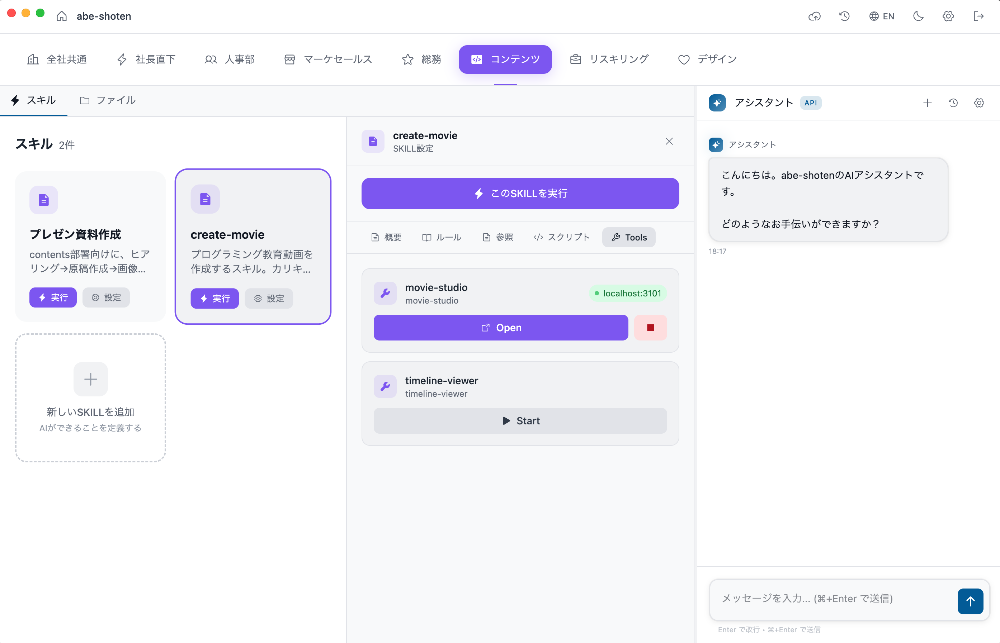
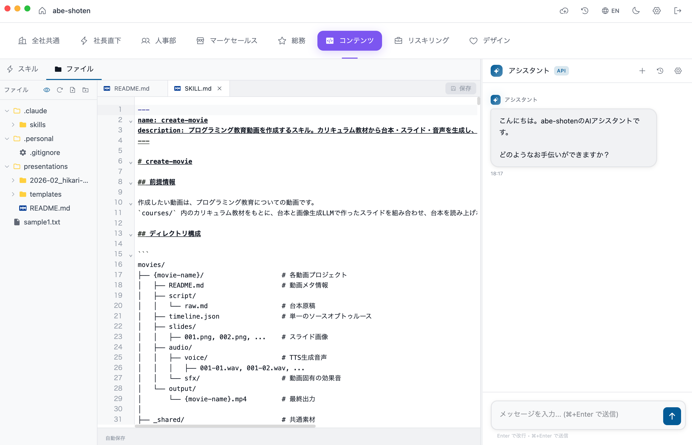
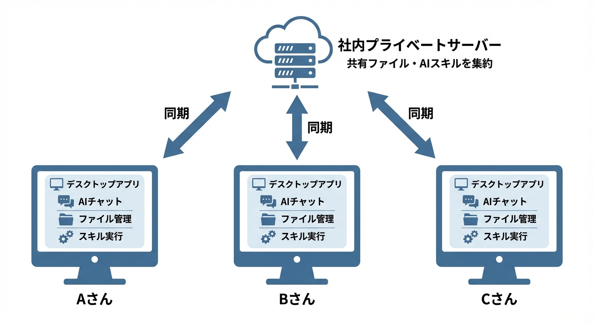

# AI Company Builder

**Share AI skills across your team — just put files in a folder.**

**Press "Sync" — that's it.** No Git, no CLI, no merge conflicts to resolve. Your team's AI skills, files, and folders are shared instantly.

> An alternative to: Notion + Dropbox + manual AI prompt sharing

[日本語版はこちら](README.ja.md)

## What is this?

A desktop app + self-hosted server that lets teams share AI agent skills, files, and context through a simple folder-based convention. No Git knowledge required — press "Sync" and everything is shared.

**Convention over Configuration** — folder structure *is* the configuration.

### Launch custom tools from within a skill



### Edit SKILL.md and manage files in a built-in editor



### Create new skills from GUI — no terminal needed


## Features

- **Skill Sharing** — Drop AI skill files into a department folder; your whole team gets them instantly
- **Zero-Config Sync** — One-button sync powered by Git (users never see Git)
- **Self-Hosted** — Your data stays on your server. No third-party dependencies
- **Bundled Git** — Works even if Git is not installed on the user's machine
- **Department Management** — Organize skills and files by team/department
- **Personal Workspace** — `.personal/` folders are never synced, giving each user a private space
- **HTTPS Git Transport** — No SSH keys to manage; authentication piggybacks on web login
- **Conflict Resolution** — Server wins, local changes are auto-backed up

## Architecture

```
┌─────────────────┐         HTTPS          ┌─────────────────┐
│  Desktop App    │◄──────────────────────►│  Self-Hosted     │
│  (Electron)     │    Git Smart HTTP      │  Server (Hono)   │
│                 │    + REST API           │                 │
│  - File browser │                        │  - Git bare repos│
│  - AI chat      │                        │  - SQLite DB     │
│  - Skill runner │                        │  - Auth (Better  │
│  - Sync button  │                        │    Auth)         │
└─────────────────┘                        └─────────────────┘
```



## Quick Start

### Prerequisites

- Node.js 20+
- pnpm 9+

### Development

```bash
# Clone the repository
git clone https://github.com/eichann/ai-company-builder.git
cd ai-company-builder

# Install dependencies
pnpm install

# Set up environment
cp .env.example .env
# Edit .env and set AUTH_SECRET (generate with: openssl rand -base64 32)

# Start the server
pnpm dev:server

# In another terminal, start the client
pnpm dev
```

### Self-Hosting (Production)

See the full self-hosting guide:

- [English](docs/self-hosting/README.md)
- [日本語](docs/self-hosting/README.ja.md)

## Tech Stack

| Component | Technology |
|-----------|-----------|
| Desktop App | Electron + React + Vite |
| Server | Hono (Node.js) |
| Database | SQLite (better-sqlite3) |
| Auth | Better Auth |
| Git | dugite (bundled) + Git Smart HTTP |
| Admin Panel | Next.js |
| Package Manager | pnpm (monorepo) |

## Project Structure

```
ai-company-builder/
├── client/     # Electron desktop app
├── server/     # Hono API server
├── admin/      # Next.js admin panel
├── shared/     # Shared TypeScript types
└── docs/       # Documentation
```

## Contributing

See [CONTRIBUTING.md](CONTRIBUTING.md) for development setup and guidelines.

## Security

See [SECURITY.md](SECURITY.md) for reporting vulnerabilities.

## License

[AGPL-3.0](LICENSE)
